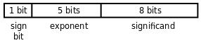

## 第 13 章 计算机中数的表示

> Latest: Mon Jan 11 10:44:46 CST 2021

**参考资料**

* [有符号数处理 - 维基百科，自由的百科全书](https://zh.wikipedia.org/wiki/%E6%9C%89%E7%AC%A6%E8%99%9F%E6%95%B8%E8%99%95%E7%90%86)
* [IEEE 754 - 维基百科，自由的百科全书](view-source:https://zh.wikipedia.org/wiki/IEEE_754)
* [13 - 如何实现减法](../../9787121181184/ch13)

### 13.3 整数的加减运算

**13.3.1 Sign and Magnitude表示法 - (原码)**

* 最高位规定为符号位，`0` 表示正 `1` 表示负，剩下的 `7` 位表示绝对值的大小

**13.3.2 1's Complement表示法 - (反码)**

* 一个负数的二进制数反码形式为其绝对值部分按位取反
* 取 `1` 的补码就是把每个 `bit` 取反，所以1的补码也称为反码

**13.3.3 2's Complement表示法**

* 正数不变，负数先取反码再加 `1`
* `1-b+1 = 10 - b`
* 在相加过程中最高位产生的进位和次高位产生的进位如果相同则没有溢出，如果不同则表示有溢出

### 13.4 浮点数

> 科学计数法：尾数(Significand) / 指数(Exponent) / 基数(Radix)

> * 符号位 / 指数部分(表示2的多少次方) / 尾数部分(小数点前面是0， 尾数部分只表示小数点后面的数字)
* `偏移的指数`: 规定一个偏移值，比如16，实际的指数要加上这个偏移值再填写到指数部分，这样比16大的就表示正指数，比16小的就表示负指数
* `正规化`: 尾数部分的最高位必须是1, 也就是说位数必须以 `0.1` 开头，对应的指数做相应的调整。由于尾数最高位必须是1， 这个1就不必保存了

* 用 0 初始化的意思是所有字节都用 0 填充

