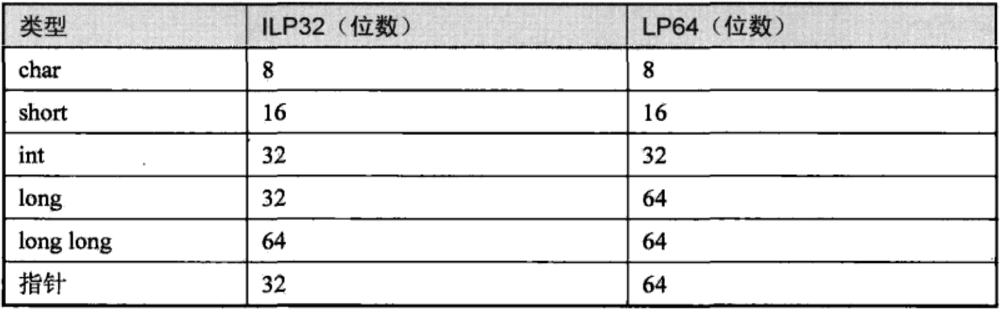
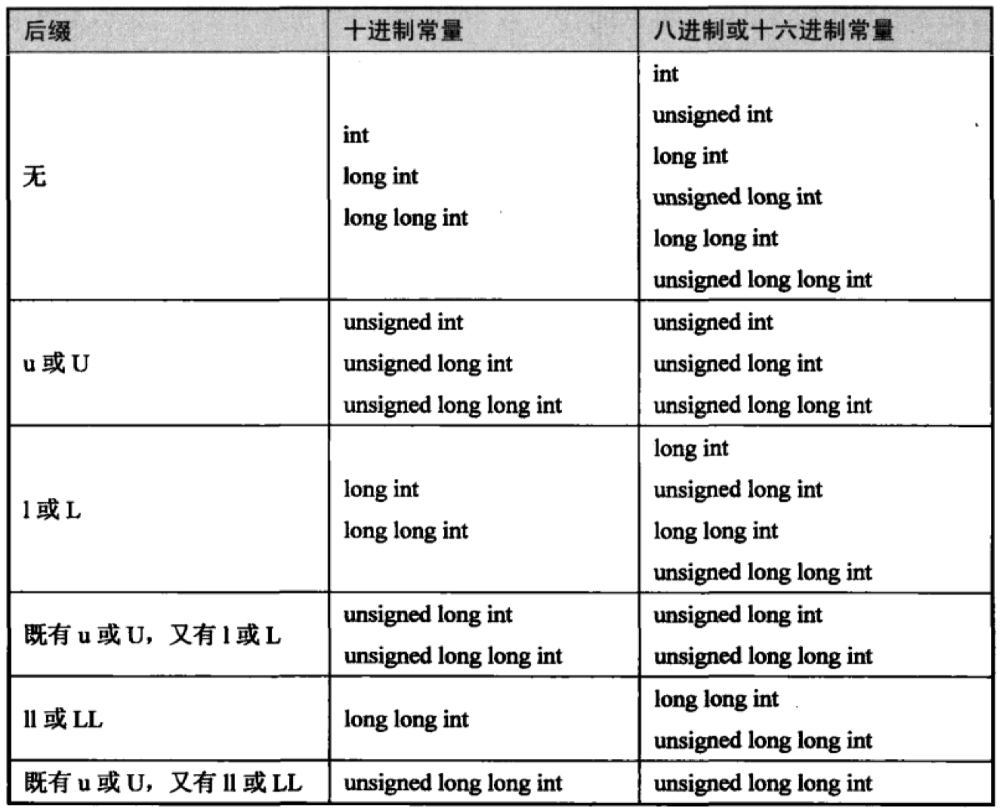

## 第 14 章 数据类型详解

> Latest: Mon Jan 11 11:14:14 CST 2021

### 14.1 整型

* 对于有符号数大多数体系结构都采用2‘s Complement 表示法
* x86 平台的 gcc 定义 char 型是有符号的
* 其他类型都表示 signed

**未明确定义**

* `Implementation-defined`：C标准没有明确规定，但是要求编译器必须对此作出明确规定
* `Unspecified`：通常有几种可选的处理方式，编译器可以任选一种处理方式
* `Undefined`：C标准没有规定该怎么处理，也没有规定这种代码的运行结果是对的

**ILP32和LP64**

* `int(I)`、`long(L)`和`指针(P)`类型都占 32 位
* `long(L)` 和 `指针(P)` 占 64 位

**整数常量后缀**

* `u或U`: `unsigned`
* `l或L`: `long`
* `ll或LL`: `long long`

> 从上到下找出第一个足够长的类型

### 14.2 浮点型

* 浮点运算单元(`Floating Point Unit, FPU`)：`硬浮点(Hard-float)`、`软浮点(Soft-float)`

**科学计数法**

* 尾数和指数之间用 `e` 或 `E` 隔开
* 如果尾数的小数点左边或右边没有数字则表示这一部分为零

**浮点数常量后缀**

* 没有后缀：`dobule`
* `f或F`: `float`
* `l或L`: `long double`

### 14.3 类型转换

**14.3.1 - Integer Promotion**

> 在一个表达式中，凡是可以使用 `int` 或 `unsigned int` 类型做右值的地方都可以使用有符号或无符号的 `char` 型、`short` 型和 `Bit-field`。如果原始类型的取值范围都能用。`int` 型表示，则其类型被提升为 `int` 如果原始类型的取值范围用 `int` 型表示不了，则提升为 `unsigned int` 型

* `Default Argument Promotion`：如果一个函数的形参类型未知，或者函数的参数列表中有 `...` 那么调用函数时要对相对应的实参做 `Ingeger Promotion`, 此外，相应的实参如果是 `float` 型的也要被提升为 `double` 型
* 算术运算中的类型转换。有符号或无符号的 `char` 型、`short` 型和 `Bit-field`在做算数运算之前要先做 `Integer Promotion`, 然后才能参与计算

**14.3.2 - Usual Arithmetic Conversion**

> 两个算术类型的操作数做算术运算，如果两边操作数的类型不同，编译器会自动做类型转换，使两边类型相同之后才做运算

* 如果有一边的类型是 `long double`，则把另一边也转成 `long double`
* 否则，如果有一边的类型是 `double`，则把另一边也转成 `double`
* 否则，如果有一边的类型是 `float`, 则把另一边也转成   `float`
* 否则，两边应该都是整型

**Integer Conversion Rank**

> 我们规定 `char`、`short`、`int`、`long`、`long long` 的转换级别一个比一个高，同一类型的有符号和无符号数具有相同的 Rank。

*  如果两边都是有符号数、或者都是无符号数，那么较低 `Rank` 的类型转换成较高 `Rank` 的类型
*  无符号数的 `Rank` 不低于有符号数的 `Rank`，则把有符号数转换成另一边的无符号类型。
* 无符号数的 `Rank` 低于有符号数 `Rank`: 如果这个有符号数的类型能够覆盖这个无符号数类型的取值范围，则把无符号数转换成另一边的有符号类型。
* 无符号数的 `Rank` 低于有符号数 `Rank`: 有符号数类型不足以覆盖这个无符号数类型的取值范围，则把两边都转成有符号数的 `Rank` 对应的无符号类型

**14.3.3 - 由赋值产生的类型转换**

* 如果赋值或初始化时等号两边的类型不相同，则编译器会把等号右边的类型转换成等号左边的类型再做赋值
* 函数调用传参的过程相当于定义形参并且用实参对其初始化
* 函数返回的过程相当于定义一个临时变量并且用 return 的表达式对其做初始化

**14.3.4 - 强制类型转换**

* 隐式类型转换：编译器根据它自己的一套规则将一种类型自动转换成另一种类型
* 显式类型转换：自己规定某个表达式要转换成何种类型
